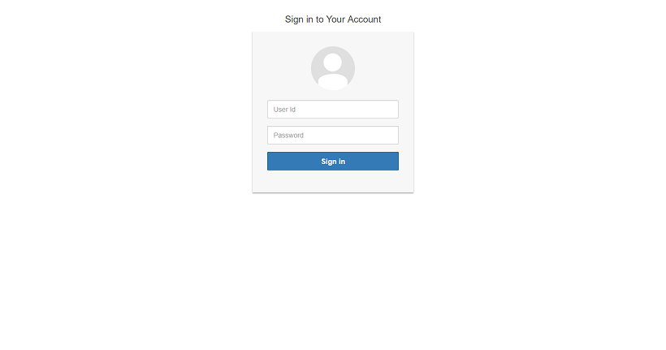
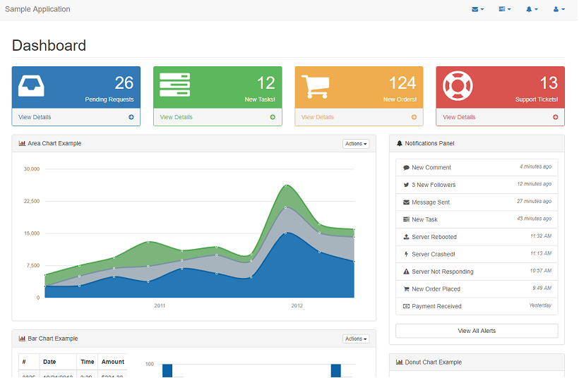
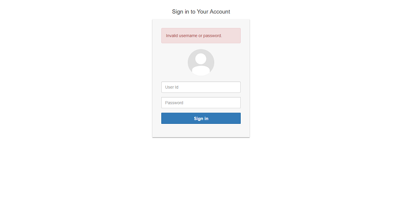

# Spring Security Multi-Authentication Showcase
> Spring Boot based sample application to show case java configurations for multiple authentication flow - Siteminder SSO and Form based Login.

## Getting started/Running the application

Clone the repository, use maven to package it as a jar and then run the jar from the target folder

```shell
 git clone https://github.com/aashaysaralkar/spring-security-multi-auth.git
 cd spring-security-multi-auth
 mvnw package -DskipTests
 cd target
 java -jar multiAuthSecurityApp-0.0.1-SNAPSHOT.jar
```

## Testing form login
After running the application, navigate to http://localhost:8080/internal/login
>

Application recognizes one user with username `'user'` and password `'password'`. Once you login, dashboard page is shown
>

If you enter invalid credentials, error message is shown on the login page
>

## Testing Siteminder SSO login
Typical SiteMinder architecture will have a web server with a SiteMinder agent and an Application server. If user requests for SSO protected resource, post authentication and authorization checks, request will be forwarded to the application with user token in SM_USER header


## Credits
I would like to thank folks at 
1. https://startbootstrap.com  for providing free Bootstrap Admin templates. This demo uses https://startbootstrap.com/template-categories/admin-dashboard/
2. https://www.tutorialrepublic.com for posting easy to use code snippets for a Bootstrap login form. This demo uses https://www.tutorialrepublic.com/codelab.php?topic=bootstrap&file=login-form-like-google

## Licensing
The code in this project is licensed under MIT license.